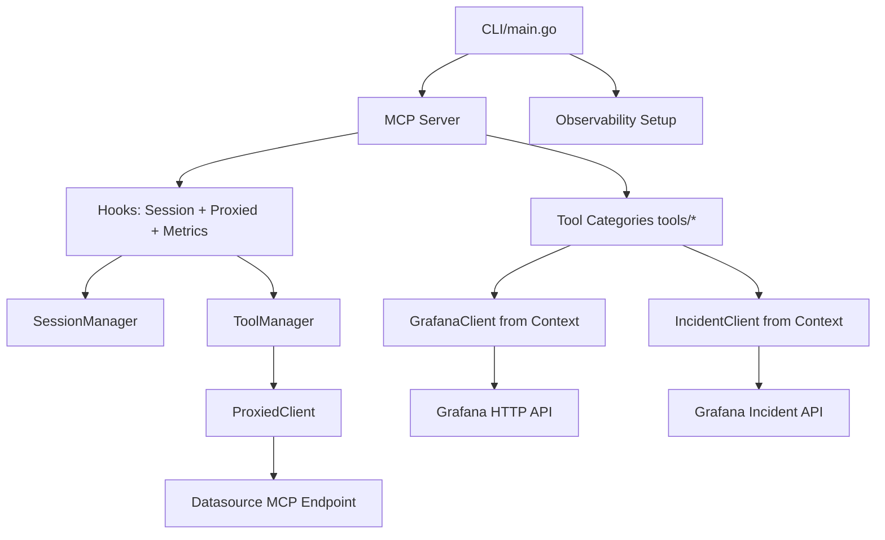
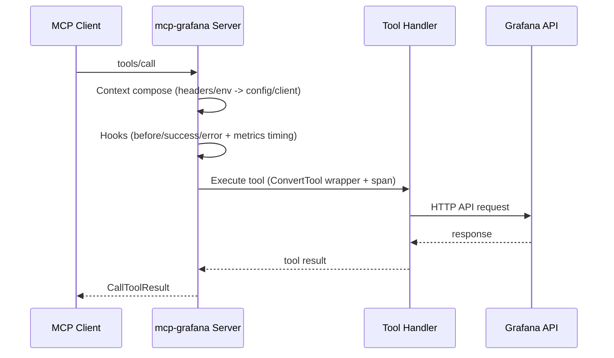

# mcp-grafana 项目架构解析

## 1. 项目定位
`mcp-grafana` 是一个 MCP（Model Context Protocol）服务端，作为 LLM 客户端与 Grafana 生态之间的适配层。  
它统一暴露工具（tools），将请求路由到：
- Grafana HTTP API（dashboard/search/datasource/alerting 等）
- Grafana 插件能力（Incident/OnCall/Sift/Asserts 等）
- 可选的 proxied MCP datasource（当前内置 tempo）

核心入口在 `cmd/mcp-grafana/main.go`，核心基础设施在根目录 `mcpgrafana.go`、`session.go`、`proxied_*.go`、`observability/`。

## 2. 运行模式

| 模式 | 服务实现 | Context 注入 | 典型场景 |
|---|---|---|---|
| `stdio` | `server.NewStdioServer` | `ComposedStdioContextFunc`（环境变量） | 本地 Agent 直连 |
| `sse` | `server.NewSSEServer` | `ComposedSSEContextFunc`（Header + Env fallback） | 长连接推送 |
| `streamable-http` | `server.NewStreamableHTTPServer` | `ComposedHTTPContextFunc` | 多客户端/网关场景 |

`streamable-http` 在 proxied tools 开启时使用有状态会话（`WithStateLess(false)`）。

## 3. 核心模块分层

## 4. 启动与装配流程
1. `main.go` 解析 flags（transport、tool 开关、TLS、metrics、log-level）。
2. 构造 `GrafanaConfig` 与 `observability.Config`。
3. `observability.Setup` 初始化 tracing/metrics provider。
4. `newServer` 创建：
   - `SessionManager`（会话状态）
   - 基础 hooks（session 注册/销毁）
   - proxied hooks（`OnBeforeListTools` / `OnBeforeCallTool`）
   - 合并观测 hooks（`observability.MergeHooks`）
5. 按 category 注册工具（`disabledTools.addTools` -> `tools.Add*Tools`）。
6. 根据 transport 启动 stdio/SSE/streamable HTTP 服务，并暴露 `/healthz`、可选 `/metrics`。

## 5. Context 与客户端注入
`mcpgrafana.go` 负责“配置提取 + client 注入”：
- 配置来源：环境变量与 Header（`X-Grafana-URL`、`X-Grafana-API-Key`、`X-Grafana-Org-Id`）。
- 组合函数：`ComposedStdioContextFunc`、`ComposedSSEContextFunc`、`ComposedHTTPContextFunc`。
- 注入对象：
  - `GrafanaConfig`（URL、token/basic auth、OrgID、TLS、extra headers、timeout）
  - `GrafanaHTTPAPI` client
  - `incident-go` client
- 传输增强：TLS、User-Agent、OrgID header、额外 headers、OTel HTTP tracing。

## 6. Tool 子系统
- 工具抽象由 `MustTool/ConvertTool` 提供：
  - 基于参数 struct 自动反射 JSON Schema
  - 统一执行包装与错误转换（支持 `HardError`）
  - 每次 `tools/call` 自动创建 OTel span
- `tools/` 目录按能力拆分（search、dashboard、datasource、prometheus、loki、clickhouse、alerting、annotations 等）。
- 写操作由 `--disable-write` 统一控制，`Add*Tools` 内按 `enableWriteTools` 选择性注册写工具。

## 7. Proxied Tools 子系统
- 发现：`discoverMCPDatasources` 列举 datasources，筛选 `mcpEnabledDatasources`（当前 tempo）。
- 探测：并发请求 `/api/datasources/proxy/uid/{uid}/api/mcp` 判定是否启用远端 MCP。
- 连接：`NewProxiedClient` 建立 streamable HTTP MCP client，并缓存远端 tool 列表。
- 注册：
  - `stdio`：`InitializeAndRegisterServerTools`，服务级一次性注册。
  - `sse/http`：`InitializeAndRegisterProxiedTools`，按 session 初始化并注册 session tools。
- 转发：`ProxiedToolHandler` 解析 `datasourceUid`，路由到对应远端工具。

## 8. 可观测性设计
`observability/` 提供：
- Tracing：当设置 `OTEL_EXPORTER_OTLP_ENDPOINT` 时启用 OTLP gRPC exporter。
- Metrics：`--metrics` 开启 Prometheus 指标，使用 MCP semconv 记录：
  - `mcp_server_operation_duration_seconds`
  - `mcp_server_session_duration_seconds`
- HTTP 层统一经 `WrapHandler` 做 OTel instrumentation。

## 9. 关键调用时序（以 streamable-http 为例）

## 10. 扩展建议
- 新增 tool 分类：在 `tools/<category>.go` 实现 `Add<Category>Tools`，并在 `main.go` 的 `disabledTools` 与 `addTools` 中注册开关。
- 新增 proxied datasource：在 `mcpEnabledDatasources` 增加 type 与 endpointPath，并补充集成测试。
- 新增 context 能力：以 `Compose*ContextFuncs` 方式插拔，避免侵入工具实现。
